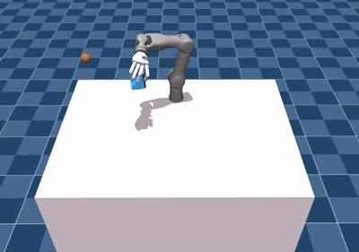

# Revo-MjLab

BrainCo Revo3 task package for [mjlab](https://github.com/mujocolab/mjlab).

This repository is a standalone mjlab task package. It registers BrainCo tasks through the `mjlab.tasks` entry point and is intended to be used with the official mjlab `train` and `play` commands.

## Included Tasks

| Robot | Task | Task ID | Demo |
| --- | --- | --- | --- |
| Revo3 arm + hand | Dexsuite lift | `BrainCo-Dexsuite-Arm-BrainCo-Lift-v0` |  |
| Revo3 arm + hand | Dexsuite reorient | `BrainCo-Dexsuite-Arm-BrainCo-Reorient-v0` | - |
| Revo3 right hand | In-hand rotation | `BrainCo-Revo3-Right-Inhand-Rotate-v0` | - |

## Repository Layout

```text
Revo-MjLab/
|-- image/                  # Task demo GIFs
|-- scripts/                # Small helper scripts
`-- source/
    |-- assets/             # URDF/STL assets for arm-hand Dexsuite tasks
    |-- pyproject.toml      # mjlab task package metadata
    `-- src/brainco_mjlab_tasks/
        |-- assets/         # Package-local MJCF assets
        |-- dexsuite/       # Arm-hand lift/reorient tasks
        `-- inhand/         # Revo3 right-hand in-hand rotation task
```

## Install

Install mjlab first by following the official mjlab documentation. Then install this task package:

```bash
cd Revo-MjLab/source
pip install -e .
```

## List Tasks

```bash
PYTHONPATH=source/src python scripts/list_envs.py --keyword BrainCo
```

In an installed mjlab environment, the tasks also load through the `mjlab.tasks` entry point.

## Train

```bash
train BrainCo-Dexsuite-Arm-BrainCo-Lift-v0 \
  --video True \
  --env.scene.num-envs 4096 \
  --gpu-ids "[0]"
```

```bash
train BrainCo-Revo3-Right-Inhand-Rotate-v0 \
  --headless True \
  --env.scene.num-envs 4096 \
  --gpu-ids "[0]"
```

## Play

Native MuJoCo viewer:

```bash
play BrainCo-Dexsuite-Arm-BrainCo-Lift-v0 \
  --wandb-run-path <user>/<project>/<run> \
  --num-envs 1 \
  --viewer native
```

Browser viewer:

```bash
play BrainCo-Dexsuite-Arm-BrainCo-Lift-v0 \
  --wandb-run-path <user>/<project>/<run> \
  --num-envs 1 \
  --viewer viser
```

## Scope

This repository contains simulation tasks only. It does not include sim2sim or hardware deployment code.
